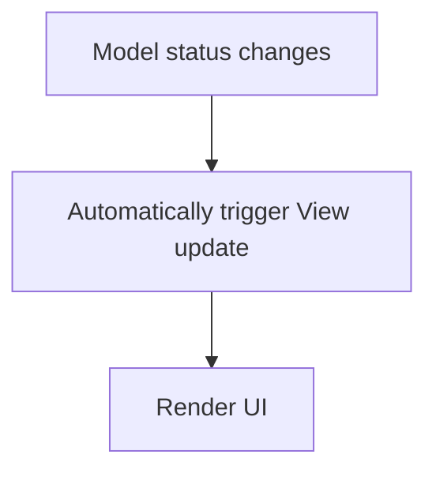

# HarmonyOS Next smart terminal practical combat: Cangjie Language creates a responsive UI and state management system
In the HarmonyOS Next era, there were a variety of devices, including mobile phones, watches, smart screens, and IoT small terminals.In this context, user experience has become a key factor in the success of the application.Implementing a smooth responsive interface and ensuring that the system remains stable and consistent in a changing state is a difficult problem that every developer needs to overcome.

This article is based on Cangjie language, and designs and implements a lightweight, elegant and high-performance responsive UI and state management system through practical methods, taking into account performance experience and clear architectural design.

## 1. Responsive architecture design
### Why do you need a responsive UI?
The traditional imperative update method is as follows:
```
if (dataChanged) {
    updateUI()
}
```
There are many problems with this method:
1. The update logic is scattered, which is prone to omissions and leads to errors.
2. It is difficult to synchronize data status changes with UI updates.
3. The system maintenance and expansion is difficult.

The characteristic of the responsive UI model is that data changes will automatically trigger interface updates.It has the following advantages:
1. Clarify the data-driven principles to make UI updates more intuitive.
2. Have a unified update channel for easy management and maintenance.
3. Easy to expand and test.

### How can Cangjie's language help?
1. **Property mechanism (prop/mut prop)**: Can transparently encapsulate getter/setter to realize monitoring of data changes.
2. **Pipe Operator (|>) + Lambda**: It can build a clear and natural data processing chain and optimize the data processing process.
3. **Tail Lambda**: Make control logic closer to natural language style and improve the readability of the code.
4. **Lightweight threads**: Ensure that UI updates do not block the main process and ensure smooth operation of the system.

### Architecture diagram diagram

The core idea is to decouple the Model from the View to achieve automatic perception of changes.

## 2. Establishing the status management model
### Basic state model design
Use Algebraic Data Types (ADT) to manage application status and distribute update logic with the help of pattern matching (match-case).
#### Define state enumeration
```
enum UIState {
    | Loading
    | Loaded(String)
    | Error(String)
}
```
1. Clearly list all legal statuses.
2. Each state can carry relevant data, such as success data or error messages.

#### Define view controller
```
class ViewController {
    mut prop currentState: UIState {
        get() {
            _state
        }
        set(newState) {
            _state = newState
            this.render(newState)
        }
    }

    private var _state: UIState = Loading

    private func render(state: UIState) {
        match(state) {
            case Loading => println("UI: Loading...")
            case Loaded(data) => println("UI: Displaying ${data}")
            case Error(msg) => println("UI: Error - ${msg}")
        }
    }
}
```
1. `currentState` is a mut prop.
2. Each time it is assigned a value, the rendering logic will be automatically triggered, without manually calling `updateUI`.

#### Simulated state flow
```
main() {
    let controller = ViewController()

    thread.start {
        sleep(2 * Duration.Second)
        controller.currentState = Loaded("Sensor Data: 25°C")

        sleep(3 * Duration.Second)
        controller.currentState = Error("Connection lost")
    }

    while (true) {
        sleep(10 * Duration.Second)
    }
}
```
Output example:
```
UI: Loading...
UI: Displaying Sensor Data: 25°C
UI: Error - Connection lost
```

### Summary of design points
|Technical Points | Functions |
|--|--|
|Attribute encapsulation listening mechanism | Transparent trigger rendering logic |
|ADT management status collection | Ensure state completeness |
|Pattern matching |Clear processing of each state |

Compared with traditional if-else logic decentralized processing, this pattern is clearer, orderly and scalable.

## 3. Double improvement of performance and experience
### How to ensure that high-frequency data is updated smoothly?
1. **Lightweight thread update**: Separate UI update triggers from data collection so that they do not block each other, ensuring that the system responds in a timely manner.
2. **Batch Rendering**: Merge multiple state changes, reduce the UI refresh frequency, and improve performance.
3. **Pipe operation processing flow**: Use Cangjie pipeline operators to clearly manage data processing links and optimize data processing processes.

### Example: Data flow + combined batch optimization
```import runtime.concurrent

class DataProvider {
    let updates = concurrent.Queue()

    public func push(state: UIState) {
        updates.enqueue(state)
    }

    public func listenUpdates(viewController: ViewController) {
        thread.start {
            while (true) {
                if (let state = updates.dequeue()) {
                    viewController.currentState = state!!
                }
            }
        }
    }
}

main() {
    let viewController = ViewController()
    let dataProvider = DataProvider()

    dataProvider.listenUpdates(viewController)

    thread.start {
        dataProvider.push(Loading)
        sleep(1 * Duration.Second)
        dataProvider.push(Loaded("Humidity: 45%"))
        sleep(2 * Duration.Second)
        dataProvider.push(Error("Sensor failure"))
    }

    while (true) {
        sleep(10 * Duration.Second)
    }
}
```
1. `DataProvider` uses a concurrent security queue to collect state changes.
2. Listen through independent threads and push the status to `ViewController`.
3. The main thread is not affected and the overall operation is smooth and natural.

## Summary
The responsive UI and state management system created through Cangjie Language has the following characteristics:
|Features | Description |
|--|--|
|Definite data-driven architecture |State is UI, no need to trigger updates manually |
|Easy to expand and maintain | Add new status just to add mode branches |
|Efficient and smooth experience | Lightweight threading and batch optimization combine to achieve zero-aware switching |
|The code is natural and clear | Lambda and pipe symbols make logic more elegant |

In HarmonyOS Next development, this model is suitable for the following scenarios:
1. Smart screen real-time display system
2. IoT device interactive interface
3. Data visualization dashboard
4. Smart terminal interactive console

In the future, if more complex Async Streams and a combined UI framework (such as ArkTS mode), they can be further upgraded to a true Declarative Reactive UI system.

## Series Finish
At this point, all three comprehensive practical cases have been completed:
1. Asynchronous data pipeline
2. Modular concurrency service design
3. Responsive UI and state management system

These cases are based on the HarmonyOS Next ecosystem, run through the core characteristics of Cangjie language, and have both technical depth and practical application guidance value.
