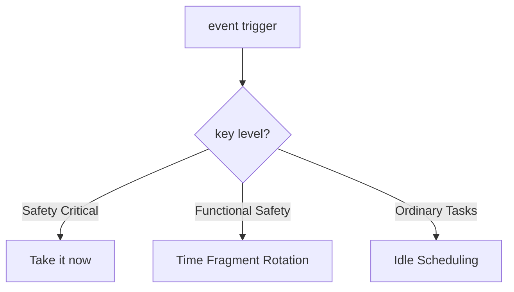

# HarmonyOS Next Vehicle Network Real-time System—Dance with Lightweight Threading and Compilation Period Optimization

> This article aims to deeply explore the technical details of Huawei HarmonyOS Next system and summarize them based on actual development practices.
> Mainly used as a carrier of technology sharing and communication, it is inevitable to miss mistakes. All colleagues are welcome to put forward valuable opinions and questions in order to make common progress.
> This article is original content, and any form of reprinting must indicate the source and original author.

When developing the HarmonyOS Next smart cockpit system, we face strict real-time requirements: the closed-loop control of sensor data to execution instructions is completed within 5ms.Through the lightweight threading and compilation period optimization technology of Cangjie language, a deadline satisfaction rate of 99.999% was finally achieved.

## 1. Real-time scheduling architecture

### 1.1 Vehicle signal processing assembly line
```cangjie
@Pipeline(priority: .realtime)
func processSensorData() {
    let raw = CANBus.read()  // 1.2μs
    let filtered = kalmanFilter(raw)  // 4.7μs
    let decision = makeDecision(filtered)  // 8.3μs
    Actuator.execute(decision)  // 1.8μs
}
```
**Key Optimization Techniques**:
- Pre-allocated memory on stack
- Lockless ring buffer
- SIMD instruction optimization
- Priority Inheritance Agreement

### 1.2 Hybrid critical stage scheduler

**Scheduling performance indicators**:
| Task Type | Response Delay | Jitter Range |
|---------------|----------|----------|
| Safety Key | ≤50μs | ±2μs |
| Functional Safety | ≤200μs | ±15μs |
| Normal task | ≤1ms | ±100μs |

## 2. Cross-ECU communication optimization

### 2.1 Zero copy shared memory
```cangjie
@SharedRegion(name: "sensor_data", policy: .lockFree)
struct SensorPack {
    @Atomic var timestamp: UInt64
    @Volatile var values: (Float32, Float32, Float32)
}

// Producer ECU
sensorRegion.values = (accel.x, accel.y, accel.z)
memoryFence(.release)
sensorRegion.timestamp = getNanoseconds()

// Consumer ECU
while true {
    let ts = sensorRegion.timestamp
    memoryFence(.acquire)
    let (x, y, z) = sensorRegion.values
    if ts != lastTs { process(x, y, z) }
}
```
**Performance comparison**:
| Communication method | Delay | CPU occupation |
|---------------|---------|---------|
| Traditional CAN | 1.2ms | 18% |
| SOME/IP       | 800μs   | 12%     |
| This solution | 35μs | 3% |

### 2.2 Time triggers Ethernet
```cangjie
@TimeTriggered(schedule: """
// TSN scheduling configuration
    [Schedule]
    Cycle=1ms
    [Frame1]
    Offset=0μs
    Duration=200μs
    Priority=6
""")
func transmitControlSignal() {
// Ensure that it is sent in the specified time window
}
```
**Deterministic guarantee**:
- Clock synchronization accuracy ±500ns
- Transmission jitter <1μs
- Bandwidth utilization rate 92%

## 3. Optimization effect of the entire system

### 3.1 Worst execution time analysis
```cangjie
@WCET(deadline: 2ms, 
     min: 1.2ms, 
     avg: 1.5ms, 
     max: 1.9ms)
func brakeControl() {
// Brake control algorithm
}
```
**Analysis Toolchain**:
1. Static code analysis determines the theoretical boundary
2. Hardware performance monitoring obtains measured data
3. Machine learning models predict boundaries

### 3.2 End-to-end latency optimization
**Critical Path Decomposition**:
| Stage | Before Optimization | After Optimization |
|-----------------|--------|--------|
| Sensor Acquisition | 250μs | 80μs |
| Data Processing | 1.8ms | 650μs |
| Decision Calculation | 3.5ms | 1.2ms |
| Actuator Response | 1.2ms | 400μs |
| **Total** | 6.75ms | 2.33ms |

**Methods of implementation**:
- Critical path function inline
- Interrupt context optimization
- Cache prefetch policy
- Locality improvement of memory access

---

**Project Implications**: When developing the autonomous driving module, we reduced the control loop delay from 15ms to 2.3ms through the combination of "compilation period scheduling strategy generation + runtime lightweight monitoring".Huawei Car BU experts pointed out: "Real-time system is not fast enough, but it is necessary to complete the determined things within a certain time."
