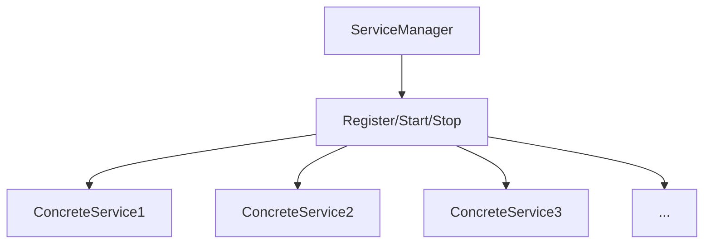

# HarmonyOS Next application engineering exploration: Cangjie language-driven modular and concurrent service design
With the full application of HarmonyOS Next, the scale and complexity of applications continue to rise.During the actual project development process, I deeply realized that only by combining reasonable modular architecture design with efficient concurrent processing frameworks can we truly support large-scale and high-quality HarmonyOS Next application development.

This article will combine practical project experience and explore how to build a modular, clear, concurrent and friendly application framework based on Cangjie language (Cangjie).

## 1. Modular Design Principles
### Goals and pain points
In the early stages of the project, many applications adopted a "functional stacking" development method, which caused a series of problems:
1. **Function fragmentation**: The coupling between each module is severe and the structure is chaotic. One modification often triggers a chain reaction and affects the entire system.
2. **Extension difficulty**: When introducing new functions, a large amount of old code is often required to be refactored, which is costly and risky.
3. **Performance Bottleneck**: Serial task processing method can easily cause resource waste, increase system delay, and reduce overall performance.

To solve these problems, in the HarmonyOS Next project, we follow the following modular design principles:
|Design Principles | Description |
|--|--|
|Single Responsibilities | Each module is responsible for only one specific category of functions, such as data collection, processing or display, etc. |
|Clear boundaries|Modules expose functions to the outside through interfaces, and other modules do not directly access their internal details to ensure the independence and security of the module|
|Generic encapsulation | For public components, such as repositories, task schedulers, etc., use generic technology to improve code reusability |
|Convenient expansion|When adding new modules, it will not affect the normal operation of existing modules, and achieve low coupling and high cohesion|

### Cangjie language empowers modularity
The characteristics of the Cangjie language include, such as generic systems, interfaces, type inference, type extension, etc., which are highly consistent with the above design principles:
1. Use generic interfaces to unify the interaction between modules and enhance compatibility and universality between modules.
2. Through the extension mechanism, system functions can be enhanced on demand according to actual needs to improve system flexibility.
3. With the help of type inference and naming parameters, improve the flexibility of module combinations and reduce complexity in the development process.

## 2. Concurrent service framework construction
In the practical application scenarios of HarmonyOS Next, a large number of tasks, such as data collection, network requests, state synchronization, etc., are essentially asynchronous and concurrent.In order to achieve efficient scheduling of these tasks, we designed a service management framework based on Cangjie's concurrency mechanism.
### Service Model Design

1. `ServiceManager` is responsible for unified registration, start and stop management of all services.
2. Each service module needs to implement the `Service` interface to ensure the consistency and standardization of services.
3. All services are run in independent lightweight threads to achieve concurrent processing and improve the system's response speed and processing efficiency.

### Core interface definition
```
public interface Service {
    func start(): Unit
    func stop(): Unit
}
```
The interface definition is concise and clear. All services only need to implement the two methods of `start` and `stop`, and follow the unified life cycle management specification.

### Service Manager Implementation
```import runtime.concurrent
import runtime.thread

public class ServiceManager {
    private let services = concurrent.ArrayList()

    public func register(s: Service) {
        services.add(s)
    }

    public func startAll() {
        for (let s in services) {
            thread.start {
                s.start()
            }
        }
    }

    public func stopAll() {
        for (let s in services) {
            s.stop()
        }
    }
}
```
1. Use the concurrent and secure `ArrayList` to store service instances to ensure the security of service management in a multi-threaded environment.
2. The `start()` method of each service is executed in an independent thread to achieve concurrent startup.
3. The `stopAll()` method is used to uniformly and gracefully stop all registered services.

### Example: Specific service module
```
public class NetworkSyncService <: Service {
    public override func start(): Unit {
        while (true) {
            println("Syncing with cloud...")
            sleep(5 * Duration.Second)
        }
    }

    public override func stop(): Unit {
        println("NetworkSyncService stopping...")
    }
}

public class SensorMonitorService <: Service {
    public override func start(): Unit {
        while (true) {
            println("Monitoring sensor data...")
            sleep(2 * Duration.Second)
        }
    }

    public override func stop(): Unit {
        println("SensorMonitorService stopping...")
    }
}
```

### Start the main application process
```
main() {
    let manager = ServiceManager()
    manager.register(NetworkSyncService())
    manager.register(SensorMonitorService())

    manager.startAll()

// Keep the main thread running
    while(true) {
        sleep(10 * Duration.Second)
    }
}
```

## 3. Type safety and interface standardization
### Why pursue interface unity?
In complex application systems, if the interaction between modules lacks clear contract specifications, the following problems are prone to occur later:
1. The parameters are inconsistent, resulting in the failure of calls between modules, affecting the normal operation of the system.
2. The dependency relationship is confusing, making it difficult to conduct effective testing, increasing the maintenance cost of the system.
3. Poor scalability, and a high cost is required to add new modules, hindering the system's functional upgrade and optimization.

### Cangjie language helps to standardize interfaces
1. **Name parameter + default value**: Make interface calls clearer and more intuitive, effectively reduce the problem of parameter error transmission, and improve the readability and maintainability of the code.
2. **Type inference**: Reduce the burden on the call side, reduce the explicit delivery of types, and reduce the probability of errors during development.
3. **Generic interface**: Can encapsulate the differences in input and output types of different modules, enhancing compatibility and universality between modules.

### Example: Unified Service Registration Interface
Define a generic registration interface:
```
func registerService(manager: ServiceManager, service!: T) {
    manager.register(service)
}
```
When called, the system will naturally infer the type without repeated declarations:
```
registerService(manager, service: NetworkSyncService())
registerService(manager, service: SensorMonitorService())
```
If there are new service modules in the future, just register in the same way:
```
registerService(manager, service: NewCustomService())
```
This method does not require changes to the core framework code and is extremely scalable.

## Summary
Through this case, we have practiced how to use Cangjie language to build an engineering application infrastructure in HarmonyOS Next with the following characteristics:
1. The module has clear boundaries and clear responsibilities, which are easy to develop and maintain.
2. Unified interface specifications reduce the coupling between modules and improve system compatibility and scalability.
3. Concurrent processing is efficient, making full use of system resources, and improving the system's response speed and processing capabilities.
4. Resource-friendly, easy to expand, and able to flexibly respond to changing business needs.

Summary of the core points:
|Technical Points | Actual Value |
|--|--|
|Generic interfaces | Abstract and unify module protocols to enhance compatibility and universality between modules |
|Lightweight thread concurrent processing | Realize efficient execution, ensure the system is responded quickly and improve user experience |
|Name parameters and default values ​​|Reduce miscalls, improve code readability, and reduce development and maintenance costs |
|Concurrent object library |Security management and multi-service collaboration to ensure the stability and reliability of the system in a multi-threaded environment |

This architectural model is not only suitable for IoT device management platform and multi-service scheduling framework, but also for building a back-end module management system for large mobile applications.

In the future, combining more advanced features of Cangjie language, such as concurrent Actor model, microkernel componentization, etc., it can be further upgraded to a more flexible and scalable HarmonyOS Next microservice application architecture to meet increasingly complex business needs.
