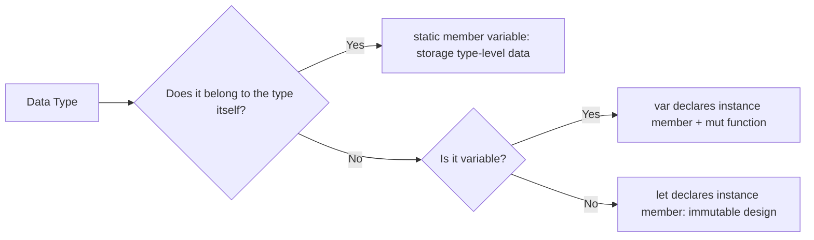

# HarmonyOS Next struct member variable detailed explanation: Collaborative design of instance members and static members

In HarmonyOS Next development, the member variable of `struct` is the basic unit of data modeling.According to whether it is an instance or type, member variables are divided into **instance member variable** and **static member variable**. There are significant differences in access methods, life cycles and applicable scenarios.This article is based on the document "0010 Creating a struct Example - Struct Type - Cangjie Programming Language Development Guide - Learning Cangjie Language.docx", and deeply analyzes the design rules and practical applications of two types of member variables.


## 1. Instance member variable: the data carrier of the binding instance

### 1.1 Definition and Initialization Rules
The instance member variable belongs to the specific instance of `struct`. Each instance has an independent copy, and its initialization method includes:
1. **Constructor initialization**: Assign values ​​to member variables in the constructor (applicable to dynamic values).
   ```typescript  
   struct Point {  
     var x: Int64  
     var y: Int64  
     public init(x: Int64, y: Int64) {  
this.x = x // Initialize in the constructor
       this.y = y  
     }  
   }  
   ```  
2. **Assign value when defining**: Directly specify the default value for member variables (applicable to fixed values).
   ```typescript  
   struct Size {  
let width = 100 // Initialize when defining
     let height = 200  
   }  
   ```  

### 1.2 Variability and Access Control
- **`let` declaration**: Immutable member variable, modification is prohibited after initialization (requires assign values ​​at the constructor or definition).
- **`var` declaration**: Variable member variables, which can be modified through the mut` function (note the mutability of the struct` instance).

**Example: Comparison of variable and immutable members**
```typescript  
struct ImmutableRect {  
let width: Int64 // Immutable member
  let height: Int64  
  public init(width: Int64, height: Int64) {  
    self.width = width  
    self.height = height  
  }  
}  
struct MutableRect {  
var width: Int64 // Variable member
  var height: Int64  
  public mut func resize(width: Int64, height: Int64) {  
This.width = width // legally modified in the mut function
    this.height = height  
  }  
}  
```  

### 1.3 Access methods for instance members
Accessed through `struct` instance, multi-level nesting (such as `instance.member.submember`).
```typescript  
struct Address {  
  var city: String  
  var street: String  
}  
struct User {  
  var name: String  
  var address: Address  
}  
let user = User(name: "Alice", address: Address(city: "Beijing", street: "Main St"))  
print(user.address.city) // Output: Beijing
```  


## 2. Static member variables: type-level shared data

### 2.1 Definition and Initialization Rules
Static member variables belong to the `struct` type itself. All instances share the same value and need to be initialized through the **static initializer (`static init`) or when defining.
```typescript  
struct Geometry {  
static let PI = 3.14159 // Initialize when defining
static var maxSide: Int64 // Need to assign a value in the static initializer
  static init() {  
maxSide = 1000 // Initialization in the static initializer
  }  
}  
```  

### 2.2 Access methods and application scenarios
- **Access by type name**: No need to create an instance, call directly through `Type.member`.
  ```typescript  
print(Geometry.PI) // Output: 3.14159
  ```  
- **Typical Scenario**:
- Global constants (such as mathematical constants, configuration parameters);
- Type-level statistics (such as instance creation times).

```typescript  
struct Counter {  
static var instanceCount = 0 // Static statistics member
  public init() {  
Counter.instanceCount += 1 // Update static members in the constructor
  }  
}  
let c1 = Counter()  
let c2 = Counter()  
print(Counter.instanceCount) // Output: 2
```  

### 2.3 Limitations and Specifications
- **Access to instance members**: Instance member variables cannot be accessed in static member functions.
  ```typescript  
  struct ErrorExample {  
    var instanceVar = 0  
    static func staticFunc() {  
print(instanceVar) // Error: Static function cannot access instance members
    }  
  }  
  ```  
- **Thread Safety**: The static initializer is guaranteed to be thread-safe by the system and can be used in multi-threaded scenarios with confidence.


## 3. Collaborative design: Complementary scenarios between instance members and static members

### 3.1 Layered design of configuration system
- **Static Member**: Stores global default configurations (such as timeout, protocol version).
- **Instance Member**: Stores instance-specific configurations (such as user-defined parameters).

```typescript  
struct AppConfig {  
// Static default configuration
  static let DEFAULT_TIMEOUT = 5000  
  static let DEFAULT_LANGUAGE = "en-US"  
// Instance configuration (can be modified dynamically)
  var timeout: Int64  
  var language: String  
  public init() {  
timeout = AppConfig.DEFAULT_TIMEOUT // Load static default value during initialization
    language = AppConfig.DEFAULT_LANGUAGE  
  }  
}  
// Use: Modify the instance configuration and retain the global default value
let config = AppConfig()  
config.timeout = 6000 // Instance specific configuration
```  

### 3.2 Static creation logic in factory mode
Create an instance through static member functions and combine instance member initialization.

```typescript  
struct JsonData {  
  var content: String  
// Static factory function: loading instance from file
  public static func load(from path: String) -> JsonData {  
    let data = FileSystem.readFile(path)  
return JsonData(content: data) // Call the instance constructor
  }  
}  
let json = JsonData.load(from: "data.json") // Static method creation instance
```  

### 3.3 Separation of constants and calculations of mathematical tool library
- **Static member**: Store mathematical constants (such as `PI`, Euler numbers).
- **Instance Member**: Stores the calculation context (such as precision, units).

```typescript  
struct MathTool {  
  static let E = 2.71828  
var precision: Int64 // Instance member: Calculation accuracy
  public func calculateLog(x: Float64) -> Float64 {  
return log(x) * Float64(precision) // Combine static constants and instance configuration
  }  
}  
let tool = MathTool(precision: 100)  
let result = tool.calculateLog(x: MathTool.E)  
```  


## 4. Common Errors and Best Practices

### 4.1 Issues in the initialization order of static members
The initialization order of static members follows the "definition order" and circular dependencies need to be avoided.

**Counterexample: Circular dependencies lead to compilation errors**
```typescript  
struct Circular {  
static let a = B.b + 1 // Depend on B.b
static let b = A.a - 1 // Depend on A.a to form a loop
}  
struct A: Circular {}  
struct B: Circular {}  
```  

**Solution**: Split the logic to avoid direct interdependence.

### 4.2 Optimization of replication overhead for instance members
For `struct` with a large number of instance members, the replication overhead can be reduced in the following ways:
- **Use `inout` parameter**: Avoid copy generation when function parameters are passed.
  ```typescript  
  func updateSize(inout size: Size, factor: Float64) {  
size.width *= factor // directly modify the original value
  }  
  ```  
- **Split into small `struct`**: Split members with low correlation into independent structures.

### 4.3 Naming specifications and readability improvements
- **Static member**: Named with `k` prefix or all capitalization (such as `kMaxSize/DEFAULT_VALUE`).
- **Instance Member**: Use camel nomenclature to avoid conflicts with type names.

```typescript  
struct Constants {  
static let kEarthRadius = 6371 // Static constant naming specification
}  
struct Planet {  
  var name: String  
var radius: Float64 // Instance member naming specification
}  
```  


## 5. Summary: Selection and Architectural Design of Member Variables

### 5.1 Selection decision tree


### 5.2 Architectural Design Principles
1. **Separation of responsibilities**: Static members handle type-level logic, and instance members handle individual states;
2. **Immutable priority**: Try to use `let` to declare instance members, and explicitly mark mutability through the `mut` function;
3. **Compilation period verification**: Use the compilation period initialization feature of static members to expose configuration errors in advance.

By rationally designing the member variables of `struct`, developers can build clear-level and efficient data models in Hongmeng applications, especially in embedded device configuration, mathematical computing libraries and other scenarios, giving full play to the synergistic advantages of value types and type-level data.
