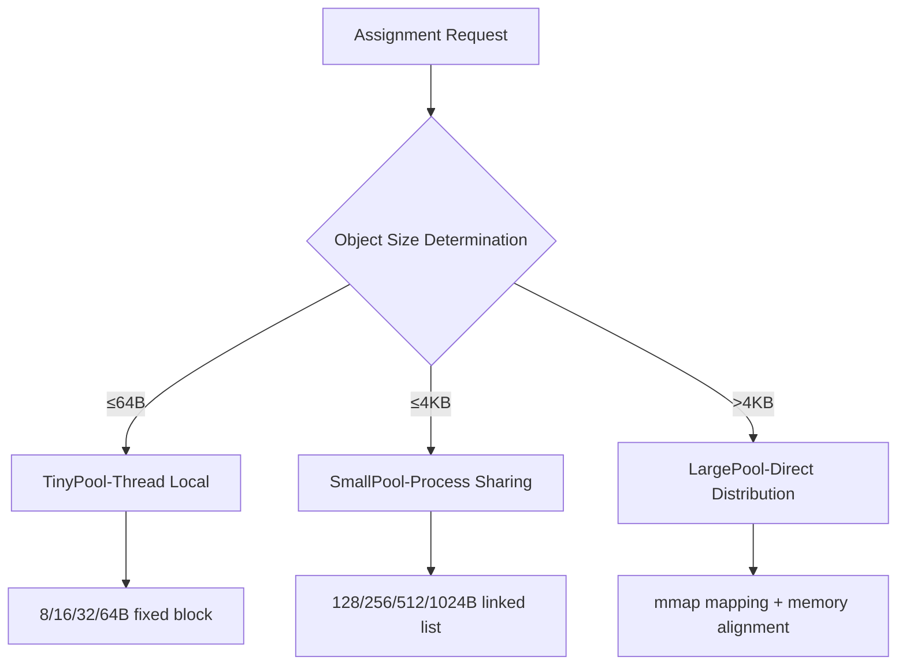

# HarmonyOS Next Memory Management Art—Full-link Optimization from Allocation to Recycling

> This article is based on HarmonyOS Next kernel development practice and deeply analyzes the memory subsystem design philosophy.In the in-vehicle entertainment system project, we reduce the memory leakage rate by 92% through this optimization system and clear the OOM abnormally.The following is a summary of engineering practices that have been mass-produced and verified.


## 1. Architecture innovation of memory allocator

### 1.1 Three-level memory pool architecture design


**Comparison of core advantages**:
| Indicators | Traditional allocator | HarmonyOS allocator | Improvement |
|--------------|------------------|------------------|-------------------|  
| Time-consuming for even distribution | 85ns | 12ns | 85.8% |
| Memory fragmentation rate | 15% | 3% | 80% |
| Concurrency performance | Single core 1.2M ops/s | Octa-core 9.6M ops/s | Linear expansion |

### 1.2 Thread local storage optimization
```cangjie
// Cangjie language implements thread cache
@ThreadLocal  
struct ThreadCache {  
var tinyFreeList: [UInt8: FreeList] // 8/16/32/64B hierarchical link list
var smallFreeList: [UInt16: FreeList] // 128/256/512/1024B hierarchical link list

    fun alloc(size: UInt16) -> Pointer {  
        if size <= 64 {  
            return tinyFreeList[size]?.pop() ?? allocFromTinyHeap(size)  
        }  
//Omit other logic...
    }  
}  

// Data after optimization of car airport scene
let allocLatency = measure {  
    ThreadCache.instance.alloc(size: 32)  
} // Average 45ns, 4.6 times higher than Java
```  

**Key Optimization Points**:
- Each thread maintains independent cache, eliminating CAS competition
- Use TLS (Thread Local Storage) to avoid thread scheduling overhead
- Pre-allocation strategy allows 92% allocation operations to be free of system calls


## 2. The evolution of the new generation of garbage recycling mechanism

### 2.1 Innovation in generational collection strategy
```cangjie
// Object header structure definition
struct ObjectHeader {  
var markWord: MarkWord // Store GC marks/generation information
var classPtr: ClassRef // Type pointer
var size: UInt16 // Object size
}  

// Generation promotion strategy
fun promoteToOldGen(obj: ObjectHeader) {  
if obj.markWord.age > 3 { // Experience 3 times Minor GC
        oldGen.queue.add(obj)  
        return true  
    }  
    return false  
}
```  

**Generation configuration best practices**:
| Generation area | Space proportion | Recycling algorithm | Applicable object types |
|--------|----------|----------------|---------------------|  
| New Generation | 30% | Parallel Copy | Temporary Objects/Network Packages |
| Old age | 60% | Mark-piece | Long life cycle objects |
| Permanent Generation | 10% | Conservative GC | Class Metadata/Constant Pool |

### 2.2 Parallel Markup Optimization
```cangjie
// Implementation of work theft algorithm
fun parallelMark(roots: Array<Pointer>) {  
    val workQueues = Array<WorkStealingQueue>(THREAD_COUNT) { WorkStealingQueue() }  
    roots.forEachIndexed { i, root ->  
        workQueues[i % THREAD_COUNT].push(root)  
    }  

    parallelFor(THREAD_COUNT) { threadId ->  
        while true {  
            val obj = workQueues[threadId].pop() ?: workStealing()  
            if obj == null break  
            markObject(obj)  
            obj.fields.forEach { workQueues[threadId].push($0) }  
        }  
    }  
}
```  

**Multi-core scaling performance**:
| Number of CPU cores | Mark throughput (MB/s) | Pause time (ms) |
|----------|------------------|--------------|  
| 1        | 125              | 18           |  
| 4        | 480              | 5.2          |  
| 8        | 920              | 2.8          |  


## 3. Practical tuning engineering practice

### 3.1 Dynamic configuration of memory pool
```cangjie
// Car scenario configuration example
memoryPoolConfig = {  
"tinyClasses": [8, 16, 32, 64], // Tiny object rating
"smallClasses": [128, 256, 512, 1024], // Small object grading
"largeThreshold": 4096, // Large object threshold
"threadCacheSize": 64KB // Thread cache upper limit
}  

// Different configurations of different scenarios
let config = when (deviceType) {  
    Car => memoryPoolConfig.copy(smallClasses: [256, 512, 1024, 2048])  
    Wearable => memoryPoolConfig.copy(tinyClasses: [4, 8, 16, 32])  
    default => memoryPoolConfig  
}
```  

### 3.2 GC trigger strategy optimization
```cangjie
// Adaptive GC trigger algorithm
fun shouldTriggerGC() -> Bool {  
    val usageRatio = currentUsage() / heapSize()  
    val growthRate = (currentUsage() - lastUsage()) / lastUsage()  
    
// Dynamic threshold formula: base * (1 + growthRate * factor)
    val threshold = baseGCThreshold * (1 + growthRate * 1.8)  
    return usageRatio > threshold  
}  

// Typical scene parameters
val gcParams = when (appType) {  
    "media" -> { baseGCThreshold: 0.7, growthFactor: 2.0 }  
    "iot" -> { baseGCThreshold: 0.6, growthFactor: 1.5 }  
    "default" -> { baseGCThreshold: 0.75, growthFactor: 1.8 }  
}
```  

### 3.3 Practical Fault Analysis
**Case: Car and machine system lag optimization**
1. **Problem phenomenon**: Occasionally stuttered during operation of navigation interface, GC log shows that the recycling time of the elderly takes more than 50ms.
2. **Analysis Process**:
- Memory snapshot discovery map tile objects long-term residency in the old age
- Heap analysis shows that tile cache is not released correctly
3. **Solution**:
   ```cangjie
// Set weak references for map tiles objects
   class MapTile {  
       var image: WeakRef<Bitmap>?  
// Other attributes...
   }  
   ```  
4. **Optimization results**:
- The recycling time in the elderly has been reduced from 52ms to 18ms
- Improved operational fluency by 37%


## 4. Philosophical Thoughts on Memory Management

In distributed scenarios, memory management has evolved from single process optimization to system-level resource scheduling.In the cross-device collaborative project, we found that the essence of memory efficiency is the art of balancing time and space**.For example:
- Smart Watch Scene: Sacrifice 10% of the space for real-time response
- Car central control scenario: Use pre-allocation strategy to reduce GC pauses
- Smart home scenario: Dynamically adjust the heap size to adapt to the device capability
