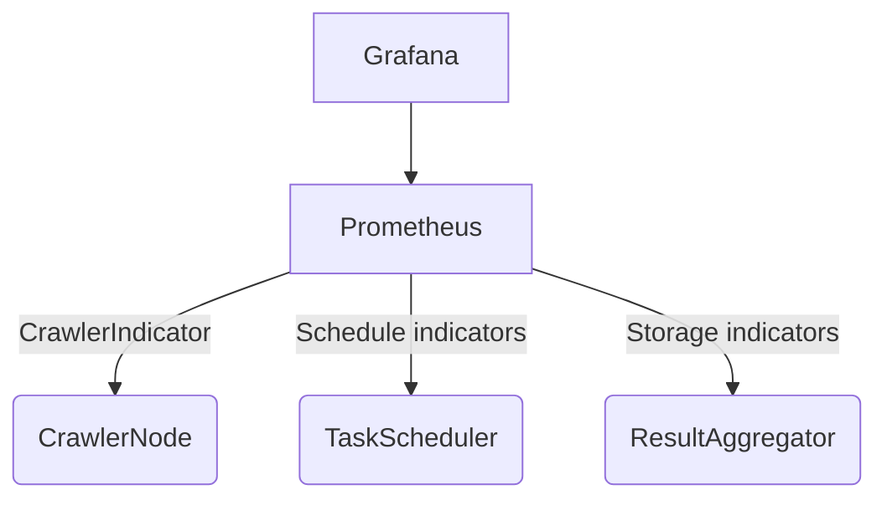

# HarmonyOS distributed crawler practice: Actor model architecture analysis

> As a developer who has struggled in the Hongmeng distributed system, he has used the Actor model to build a crawler system with an average daily request of tens of millions.This article shares practical experience from architecture design to fault-tolerant optimization, and helps you create efficient and stable distributed crawlers with the Actor model.


## 1. Core architecture: three-character Actor collaborative design

### 1.1 Crawler node Actor (responsible for web crawling)
```cj
actor CrawlerNode {
    private var taskQueue: [String] = []
    private let aggregator: ActorRef<ResultAggregator>
    
    init(aggregator: ActorRef<ResultAggregator>) {
        this.aggregator = aggregator
    }
    
    receiver func addTask(url: String) {
        taskQueue.append(url)
        processTasks()
    }
    
    private func processTasks() {
        while !taskQueue.isEmpty {
            let url = taskQueue.removeFirst()
            if let content = fetchPage(url) {
                let data = parsePage(content)
                aggregator.send(StoreData(data))
            } else {
// Failed mission re-enter
                taskQueue.append(url)
            }
        }
    }
    
    private func fetchPage(_ url: String) -> String? {
// Network request with retry
        for _ in 0..3 {
            do {
                return Http.get(url).content
            } catch {
sleep(1) // Retry the interval
            }
        }
        return nil
    }
}
```  

### 1.2 Task Scheduler Actor (Load Balancing)
```cj
actor TaskScheduler {
    private var nodes: [ActorRef<CrawlerNode>] = []
    private var taskQueue: [String] = []
    
    receiver func register(node: ActorRef<CrawlerNode>) {
        nodes.append(node)
        dispatchTasks()
    }
    
    receiver func addTask(url: String) {
        taskQueue.append(url)
        dispatchTasks()
    }
    
    private func dispatchTasks() {
        while !taskQueue.isEmpty {
            let node = nodes.min(by: { $0.load < $1.load })!
            node.send(addTask(taskQueue.removeFirst()))
        }
    }
}
```  

### 1.3 Result Aggregator Actor (Data Processing)
```cj
actor ResultAggregator {
    private var dataStore: DataStore
    
    receiver func StoreData(data: [String]) {
        dataStore.save(data)
        if dataStore.count % 100 == 0 {
            flushToDB()
        }
    }
    
    private func flushToDB() {
// Batch writing to the database
    }
}
```  


## 2. Fault tolerance mechanism: breakpoint continuous crawling and exception handling

### 2.1 Breakpoint continuous crawling implementation
```cj
actor CheckpointManager {
    private let db: Database
    
    func saveState(nodes: [ActorRef<CrawlerNode>]) {
        var tasks = [String]()
        for node in nodes {
            tasks.append(contentsOf: node.taskQueue)
        }
        db.save("crawler_tasks", tasks)
    }
    
    func restoreState() -> [String] {
        return db.load("crawler_tasks") ?? []
    }
}
```  

### 2.2 Exception retry strategy
```cj
extension CrawlerNode {
    private func fetchWithRetry(url: String, retries: Int = 3) -> String? {
        if retries == 0 {
            log("Failed: \(url)")
            return nil
        }
        
        do {
            return Http.get(url, timeout: 5s).content
        } catch {
sleep(1s * retries) // Exponential backoff
            return fetchWithRetry(url, retries-1)
        }
    }
}
```  


## 3. Performance optimization: from code to architecture

### 3.1 Network IO Optimization
1. **Connection pool multiplexing**:
```cj
actor HttpPool {
    private let pool: ConnectionPool
    
    func getConnection() -> HttpConnection {
        return pool.borrow()
    }
    
    func release(connection: HttpConnection) {
        pool.release(connection)
    }
}
```  

2. **Concurrent Control**:
```cj
actor CrawlerNode {
private let semaphore = Semaphore(5) // Limit the number of concurrent requests
    
    private func fetchPage(_ url: String) -> String? {
        semaphore.acquire()
        defer { semaphore.release() }
        
// Request processing...
    }
}
```  

### 3.2 Visual monitoring


**Mining Key Indicators**:
- Node load (time-consuming task processing)
- Network request success rate
- Data storage throughput


## 4. Practical deployment: from stand-alone to cluster

### 4.1 Distributed Deployment Architecture
```  
┌─────────────┐    ┌─────────────┐    ┌─────────────┐  
│ Node 1 │ │ Node 2 │ │ Node 3 │
│ (Crawler)   │    │ (Crawler)   │    │ (Scheduler) │  
└─────────────┘    └─────────────┘    └─────────────┘  
↑ Message bus ↑ Message bus ↑
    └────────────────┼────────────────┘  
             ┌──────────────────────┐  
│ Distributed Message Middleware │
             └──────────────────────┘  
```  

### 4.2 Cluster Scaling Policy
1. **Dynamic expansion and capacity**:
```cj
actor ClusterManager {
    func scaleOut() {
        for _ in 0..3 {
            spawn(CrawlerNode(aggregator))
        }
    }
    
    func scaleIn() {
// Select the low load node to close
    }
}
```  

2. **Failover**:
```cj
actor Scheduler {
    receiver func nodeFailed(node: ActorRef<CrawlerNode>) {
        nodes.remove(node)
        rebalanceTasks()
    }
}
```  


## 5. Pit avoidance guide: The life and death line of distributed crawlers

1. **Task Repeated Crawl**:
- Use a Bloom filter to deduplicate URLs to avoid repeated tasks

2. **Network Congestion**:
- Implement global request speed limit, and control by domain name

3. **Data consistency**:
- Result aggregators use idempotent storage to avoid duplicate data
