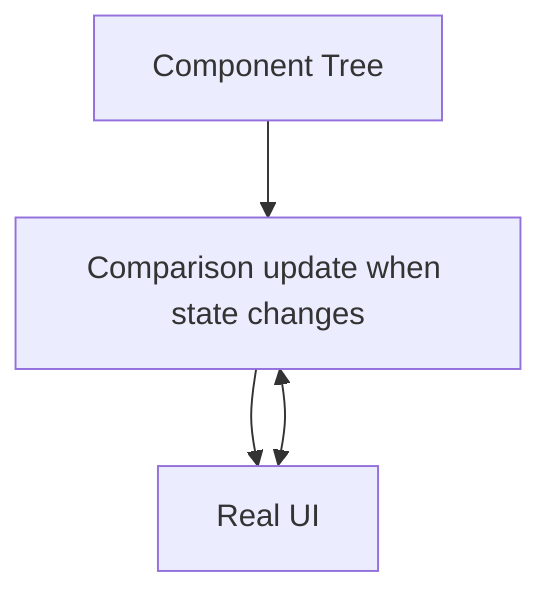

# HarmonyOS declarative UI development: from state management to cross-end adaptation practice

> As a veteran of Hongmeng UI development, the interface flickered due to improper status management and was tortured by cross-end adaptation.This article combines practical experience and analyzes the core principles and optimization techniques of declarative UI to help you avoid common traps and create a silky Hongmeng interface.


## 1. The core of declarative UI: component tree and virtual DOM

### 1.1 Mapping of component tree and virtual DOM
The declarative UI is like building blocks, using component trees to describe the interface, and the virtual DOM is responsible for efficient updates:

```cj
@Entry
@Component
struct Counter {
    @State count = 0
    
    build() {
        Column {
Text("Count: \(count)")
                .fontSize(24)
            Button("+1")
                .onClick { count++ }
        }
        .padding(20)
    }
}
```  

**Rendering process**:
1. First rendering: Component Tree → Virtual DOM → Real UI
2. Status update: Only the changed virtual DOM nodes → minimize real UI modifications




## 2. Responsive core: @State and state management

### 2.1 The implementation principle of @State
@State implements responsive updates through data hijacking + publish subscription:

```cj
// @State internal implementation simplified version
class State<T> {
    private var value: T
    private var subscribers: Set<() -> Void> = []
    
    init(_ value: T) {
        self.value = value
    }
    
    var wrappedValue: T {
        get { value }
        set {
            if value != newValue {
                value = newValue
                subscribers.forEach { $0() }
            }
        }
    }
    
    func subscribe(_ callback: @escaping () -> Void) {
        subscribers.insert(callback)
    }
}
```  

### 2.2 Status Update Best Practices
1. **BatchUpdate**: Reduce redraw with `.batchUpdate`
```cj
Button("Batch Update")
    .onClick {
        this.batchUpdate {
            count1++
            count2++
            count3++
        }
    }
```  

2. **State shard**: Split too large state into small units
```cj
// Counterexample: Large state object
@State user = UserInfo() 

// Positive example: Split state
@State username = ""
@State avatarUrl = ""
```  


## 3. Cross-end adaptation: style abstraction and elastic layout

### 3.1 Style abstraction layer design
Implement multi-end style adaptation through abstract classes:

```cj
// Abstract style class
abstract class ButtonStyle {
    var bgColor: Color = Color.Blue
    var textColor: Color = Color.White
    var radius: Float = 8.0
    
    abstract func applyTo(button: Button)
}

// Mobile style
class MobileButtonStyle: ButtonStyle {
    override func applyTo(button: Button) {
        button.backgroundColor(bgColor)
            .fontSize(16)
            .cornerRadius(radius)
    }
}

// Tablet end style
class TabletButtonStyle: ButtonStyle {
    override var radius: Float = 12.0
    override func applyTo(button: Button) {
        button.backgroundColor(bgColor)
            .fontSize(20)
            .cornerRadius(radius)
            .padding(16)
    }
}
```  

### 3.2 Flexible layout practice
```cj
@Entry
@Component
struct ResponsiveLayout {
    build() {
        Column {
Text("Title")
                .fontSize(if Device.screenWidth > 600 { 28 } else { 24 })
            
            if Device.abilityType == .wearable {
// Simplified layout of the watch
Text("Lease Content")
            } else {
// Complete layout of other equipment
                Row {
Text("Content 1")
Text("Content 2")
                }
            }
        }
        .width("100%")
        .padding(if Device.screenType == .large { 32 } else { 16 })
    }
}
```  


## 4. Performance optimization: rendering efficiency improvement skills

### 4.1 Avoid unnecessary repainting
1. **Use @Link instead of @State**: Only one-way synchronization is required
```cj
// Parent component
@State count = 0
ChildComponent(count: $count) // Pass @Link using $ symbol

// Subcomponents
struct ChildComponent {
    @Link count: Int
// Modifying the child component count will be synchronized to the parent component, but modifying the parent component will not trigger the child component to be repainted
}
```  

2. **Memory Components**: Avoid repeated creation of the same components
```cj
@Entry
@Component
struct MemoComponent {
    @State items = [1, 2, 3]
    
    build() {
        ForEach(items, key: \.self) { item in
Memo { // Memorize the package, the same item will not be repainted
                Text("Item: \(item)")
                    .fontSize(16)
            }
        }
    }
}
```  


## 5. Practical pit avoidance guide

### 5.1 State Management Trap
1. **Circular Dependencies**:
```cj
// Counterexample: A and B quote each other @State
struct A { @State b: B }
struct B { @State a: A } // Causes a rendering dead loop
```  

2. **Overlarly large state object**:
```cj
// Counterexample: Modifying an attribute causes the entire object to be repainted
@State user = User(
name: "Zhang San",
address: "Beijing",
    preferences: ["darkMode": true]
)
```  

### 5.2 Cross-end adaptation trap
1. **Hardcoded size**:
```cj
// Counterexample: Fixed pixel value, different devices display abnormality
Text("Content")
.width(200) // VP units or percentages should be used
```  

2. **Platform-specific API calls directly**:
```cj
// Counterexample: Directly call the Android API
if (getPlatform() == "android") { /*...*/ } // It should be called through the abstract layer
```  