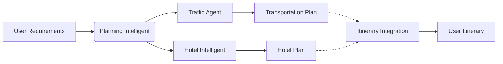
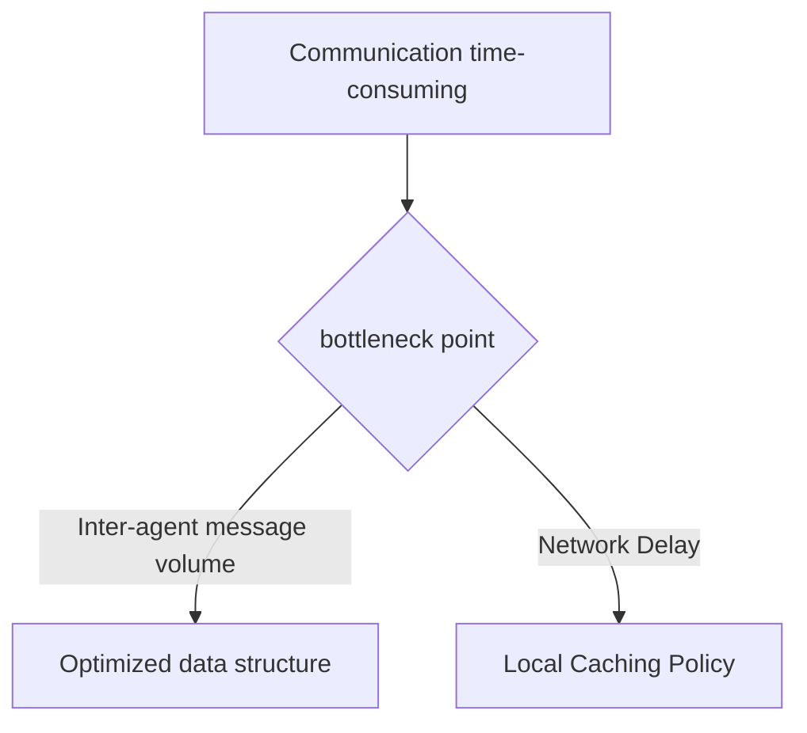

# HarmonyOS Intelligent Travel Planning: Agent DSL Practical Guide

> As a Hongmeng developer who has developed tourism applications with Agent DSL, he has delayed planning due to the low communication efficiency of multiple agents.This article shares practical experience from architecture design to performance optimization, and helps you create a responsive travel planning system with Agent DSL.


## 1. Multi-agent collaborative architecture

### 1.1 Three-core Agent role division


- **Planner Agent**: Analyze user needs and generate a itinerary framework
  ```cj
  @agent class TripPlanner {
      @prompt[pattern=OptimizeItinerary]
      func generate(itinerary: String, preferences: Map) -> Itinerary {
// Call the Attraction API to optimize the route
          let spots = fetchAttractions(preferences)
          return optimizeRoute(spots)
      }
  }
  ```  

- **Transport Agent**: Book transportation based on the itinerary
- **Hotel Agent**: Match the itinerary and book accommodation


## 2. Core code implementation

### 2.1 @prompt Dynamic Optimization Practical Battle
```cj
@agent class SmartPlanner {
// Design of prompt words for dynamic optimization of itinerary
    @prompt[
pattern = "intelligent itinerary planning",
context = "Combined with real-time weather and tourist data of attractions",
examples = ["Input: 7-day tour in Chengdu, output: daily itinerary with transportation and accommodation"]
    ]
    func planTrip(request: String) -> Itinerary {
        let parsed = parseRequest(request)
// Call the weather API to obtain data in the next 7 days
        let weather = fetchWeather(parsed.destination)
// Adjust the trip based on weather
        return adjustItinerary(parsed, weather)
    }
}
```  

### 2.2 Multi-agent flow collaboration
```cj
func main() {
let userReq = "Beijing 5-day tour, budget 3,000, like historical attractions"
    
// 1. Planning the itinerary
    let planner = SmartPlanner()
    let itinerary = planner.planTrip(userReq)
    
// 2. Parallel reservation of transportation and hotels (asynchronous collaboration)
    let transport = TransportAgent()
    let hotel = HotelAgent()
    
    let [transportResult, hotelResult] = awaitAll([
        async { transport.book(itinerary) },
        async { hotel.book(itinerary) }
    ])
    
// 3. Integration results
    let finalPlan = integrate(itinerary, transportResult, hotelResult)
    displayPlan(finalPlan)
}
```  


## 3. Performance optimization and deployment

### 3.1 Communication bottleneck analysis
Positioning problems using the Hongmeng Visualization Tool:


**Optimization Strategy**:
- Message compression: Serialize the itinerary data to compress 40%
- Local cache: 24 hours of information cache for popular attractions

### 3.2 Flexible deployment plan
| Scenarios | Deployment Methods | Advantages |
|------------|----------------|--------------------|  
| Internal Test | Local Single Node | Quick Iteration |
| Small-scale trial | Edge node cluster | Low latency response |
| Large-scale launch | Cloud-edge collaborative architecture | Elastic expansion |


## 四、实战避坑指南  

1. **Agency responsibilities overlap**:
- Counterexample: Planning an agent to handle traffic reservations simultaneously
- Positive example: Strictly separate planning and execution responsibilities

2. **Misconceptions about prompt word design**:
   ```cj
// Counterexample: fuzzy prompt words
@prompt["Planning itinerary"]
   
// Example: Constrained prompt words
   @prompt[
pattern = "48-hour Beijing Essence Tour",
constraints = "Budget ≤2000, including 3 historical attractions"
   ]
   ```  

3. **Concurrent control is missing**:
- Set concurrency upper limit for each agent (such as a maximum of 5 parallel requests for hotel agents)


## Conclusion
In actual projects, the travel planning system based on Agent DSL improves the itinerary planning efficiency by 50%, and the user waiting time is shortened to within 3 seconds.The key is to reasonably divide the responsibilities of the agent, optimize the prompt words to guide AI decisions, and optimize communication performance.
