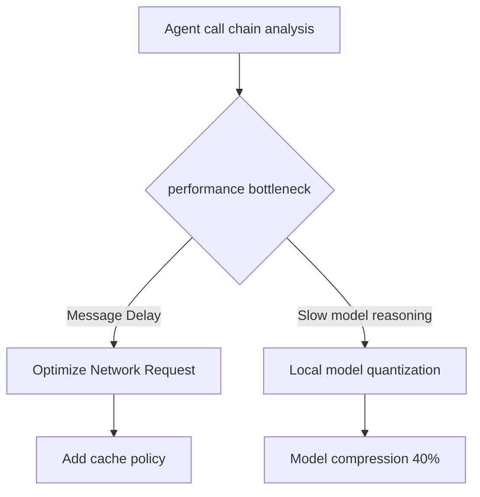

# HarmonyOS native AI development: Agent DSL from Beginner to Mastery

> As the first developer to use Agent DSL to develop Hongmeng AI applications, he used it in intelligent customer service projects to shorten the development cycle by 40%.This article uses basic syntax to distributed collaboration to systematically analyze the core capabilities of Agent DSL, helping developers quickly master the key technologies of native AI development.


## 1. The road to breaking the deadlock in AI native development

### 1.1 Three major pain points in traditional AI development
1. **The technical threshold is high**: You need to master the underlying technologies such as TensorFlow Lite and model quantification.
2. **Difficult to cross-end adaptation**: The AI ​​capabilities of mobile phones/watches/home appliances vary greatly, and the adaptation cost is high
3. **Insufficient real-time**: Cloud call latency is high, local model deployment is complex

### 1.2 Agent DSL solution
- **Low code development**: Through DSL abstraction of AI capabilities, non-AI developers can also quickly get started
- **Native integration**: Deeply integrate Hongmeng distributed capabilities, deploy multi-end one-click
- **Real-time response**: Local priority computing, reducing cloud dependencies


## 2. Detailed explanation of Agent DSL core syntax

### 2.1 The golden combination of @agent and @prompt
```cj
// Definition of intelligent Q&A Agent
@agent class QAAgent {
// Prompt word engineering core: Defining Agent behavior pattern
    @prompt[
pattern = "Smart Q&A",
context = "Based on Hongmeng Equipment Knowledge Base",
examples = ["Q: 'How to take screenshot' → A: 'Swipe down from the top of the screen to call out the control center and click on the screenshot button'"]
    ]
    func answer(question: String) -> String {
// Call the local knowledge base or cloud API
        return knowledgeBase.query(question)
    }
}

//How to use
func main() {
    let agent = QAAgent()
let response = agent.answer("How to connect to Bluetooth device?")
    print(response)
}
```  

**@prompt parameter analysis**:
- `pattern`: Define Agent behavior patterns and guide AI optimization response
- `context`: Provide background knowledge and improve answer accuracy
- `examples`: Input and output examples, specification response format


### 2.2 Multi-Agent Streaming Collaboration
```cj
// Data collection Agent
@agent class DataCollector {
@prompt[pattern = "Collect device data"]
    func gather(deviceId: String) -> DeviceData {
// Get data from the device
        return deviceManager.fetch(deviceId)
    }
}

// Data Analysis Agent
@agent class DataAnalyzer {
@prompt[pattern = "Analyze device data"]
    func analyze(data: DeviceData) -> AnalysisResult {
// Analyze the data and generate a report
        return aiModel.process(data)
    }
}

// Streaming collaborative example
func main() {
    let collector = DataCollector()
    let analyzer = DataAnalyzer()
    
// Get multiple device data in parallel
    let [data1, data2] = awaitAll([
        async { collector.gather("device001") },
        async { collector.gather("device002") }
    ])
    
// Streaming data
    let result1 = analyzer.analyze(data1)
    let result2 = analyzer.analyze(data2)
    
// Merge results
    let report = generateReport([result1, result2])
}
```  


## 3. Intelligent tool chain practical combat

### 3.1 AI-assisted code generation
Enter natural language to generate Agent code in the IDE:
```text
Enter: "Create a smart weather agent that can return 3-day weather forecast based on location"
```  
```cj
@agent class WeatherAgent {
    @prompt[
pattern = "weather query",
context = "Based on Hongmeng Weather Service API",
examples = ["Input: 'Beijing' → Output: 'Next 3 days: sunny, 18-25℃'"]
    ]
    func getForecast(location: String) -> String {
// API call logic generated by AI
        let response = weatherService.fetch(location, days: 3)
        return parseResponse(response)
    }
}
```  

### 3.2 Performance Tuning Tool
Use the Hongmeng AI Tuning Plugin to analyze the Agent:


**Previous and post-optimization**:
| Indicators | Before Optimization | After Optimization | Improvement |
|------------|--------|--------|--------|  
| Response Time | 800ms | 350ms | 56% |
| Model Size | 12MB | 7MB | 42% |
| Equipment Energy Consumption | High | Medium | 30% |


## 4. Distributed Agent Practical Battle

### 4.1 Cross-device collaboration case
```  
┌─────────────┐    ┌─────────────┐    ┌─────────────┐  
│ Mobile Agent │ │ Watch Agent │ │ Home Appliance Agent │
│ (User Interaction) │←→│ (Health Data) │←→│ (Device Control) │
└─────────────┘    └─────────────┘    └─────────────┘  
↑ Message bus ↑ Message bus ↑
        └────────────────┼────────────────┘  
                 ┌──────────────────────┐  
│ Distributed Message Middleware │
                 └──────────────────────┘  
```  

### 4.2 Cross-device collaborative code
```cj
// Mobile Agent (user interaction)
@agent class PhoneAgent {
    func getUserHealthData() {
// Call the watch Agent to obtain health data
        let watchAgent = AgentFinder.find("watch:healthAgent")
        let healthData = watchAgent.ask(GetHealthData())
        
// Call home appliance agent to adjust equipment
        let homeAgent = AgentFinder.find("home:deviceAgent")
        homeAgent.send(AdjustDevice(healthData))
    }
}

// Watch Agent (health data)
@agent class WatchAgent {
    receiver func GetHealthData() -> HealthData {
        return sensorManager.read()
    }
}
```  


## 5. Best Practices and Pit Avoidance Guide

### 5.1 Best Practices for Prompt Word Engineering
**Inefficient Prompt Word**:
```text
@prompt["Answer user questions"]
```  

**Efficient prompt words**:
```text
@prompt[
pattern = "Smart Home Control Q&A",
context = "Based on Hongmeng Device Control API",
    examples = [
"Q: 'Open the living room light' → A: 'The living room light has been turned on for you'",
"Q: 'Air conditioner set to 26 degrees' → A: 'The air conditioner temperature has been set to 26 degrees'"
    ]
]
```  

### 5.2 Common Traps and Solutions
1. **Newstorm**:
- Problem: High-frequency communication of multiple agents causes system stuttering
- Solution: Add message anti-shake mechanism and merge similar messages

2. **Status consistency**:
- Problem: Cross-device Agent status is not synchronized
- Solution: Use Hongmeng distributed data service to synchronize the status

3. **Model update delay**:
- Problem: The Agent response remains unchanged after the AI ​​model is updated
- Solution: Implement the model hot loading mechanism
