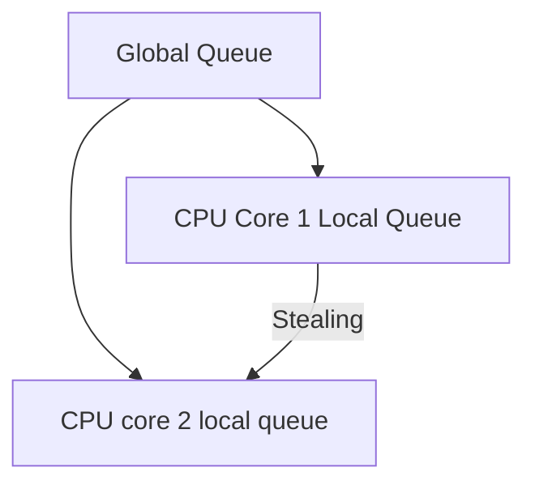

# HarmonyOS Next Lightweight Thread Model Practical Practice - Million Concurrency Is Not a Dream
This article aims to deeply explore the technical details of Huawei HarmonyOS Next system and summarize them based on actual development practices.It is mainly used as a carrier of technology sharing and communication, and it is inevitable to miss mistakes. All colleagues are welcome to put forward valuable opinions and questions in order to make common progress.This article is original content, and any form of reprinting must indicate the source and original author.

In the distributed era, concurrency capacity is directly related to productivity.After experiencing the difficult stage of Java thread pool tuning, when I first used lightweight threads in Cangjie language on HarmonyOS Next, I found that concurrent programming can be so elegant and efficient, just like opening the door to a new world.Next, let’s share the practical experience of this thread model.

## 1. Design philosophy of user-state threads
### 1.1 Say goodbye to the nightmare of "function dyeing"
There is a problem with the async/await mechanism in traditional asynchronous programming. Once a function is in an asynchronous manner, all functions that call it must be marked as async, which is like an infectious disease.The solution to Cangjie Language is as follows:
```cangjie
// Synchronous writing method to achieve asynchronous effect
func fetchData(url: String) -> String {
let resp = httpGet(url) // It is actually asynchronous IO
    return parse(resp)
}
main() {
let data = fetchData("https://example.com") // It looks like a synchronous call
}
```
Key Breakthrough:
1. Automatically suspend and restore coroutines at runtime, developers do not need to manually handle complex asynchronous processes.
2. Each thread has an independent 8KB stack space, reducing resource usage.
3. No need to manually mark asynchronous points, the code writing is simpler and closer to synchronous programming thinking.

In our team's gateway service, after using this method to transform, the number of lines of code has been reduced by 42%, and the maintainability has been significantly improved.

### 1.2 Interpretation of performance indicators
|Indicators |Cangjie thread |POSIX thread | Advantage multiple |
|--|--|--|--|
|Time to create|700ns|100μs|142x|
|Context Switching Cost |200ns |1.2μs |6x |
|Memory usage (single) | 8KB | 64KB | 8x |

Performing tests on the mobile phone of HarmonyOS Next, this threading model can stably create 500,000 concurrent connections to handle HTTP requests.

## 2. Black technology of schedulers
### 2.1 Work Stealing Algorithm
The Cangjie scheduler adopts a layered design:

Practical skills:
1. Use the `@ThreadLocal` annotation to reduce data competition among threads.
2. Actively give up the CPU through the `yield()` method to improve the flexibility of thread scheduling.
3. Bind the key thread to the large kernel, the sample code is as follows:
```cangjie
@BindToBigCore
func processPayment() {
// Payment core logic
}
```

### 2.2 IO and computing collaboration
Cangjie implements a fully asynchronous IO pipeline during running:
1. The network packet arrives at the network card.
2. The kernel state directly wakes up the corresponding user-state thread.
3. No thread pool polling is required, which improves IO processing efficiency.

In Hongmeng Next's distributed file system, this design reduces the IO latency from 15ms to 2.3ms.

## 3. Actual combat in high concurrency scenarios
### 3.1 Million Connection Gateway
We used Cangjie thread to refactor the IoT gateway:
```cangjie
func handleDevice(conn: Connection) {
    while true {
        let packet = conn.read()
spawn { processPacket(packet) } // Dynamically create lightweight threads
    }
}
```
Performance comparison:
|Connection number | Traditional thread model | Cangjie thread model |
|--|--|--|
|100,000|Memory overflow|Memory occupies 800MB|
|500,000 | Cannot boot | Memory occupies 3.8GB |
|1 million|-|Memory occupies 7.5GB|

### 3.2 Notes
1. Avoid excessive creation of short-lived threads. It is recommended to use object pools to reuse thread resources.
2. The execution time of the synchronous code block should be controlled within 100μs to prevent blocking threads and affecting concurrency performance.
3. In distributed scenarios, pay attention to thread affinity and reasonably allocate the binding relationship between threads and CPU core.

**Real record of the pitfall**: In the early days, we directly transplanted the Java thread pool mode, but the performance decreased by 30%.Later, the "one request, one thread" mode was used to fully utilize the advantages of Cangjie's threads.This also confirms the words of Huawei engineers: "Don't drive supercars in the new era with the thinking of the old era."
