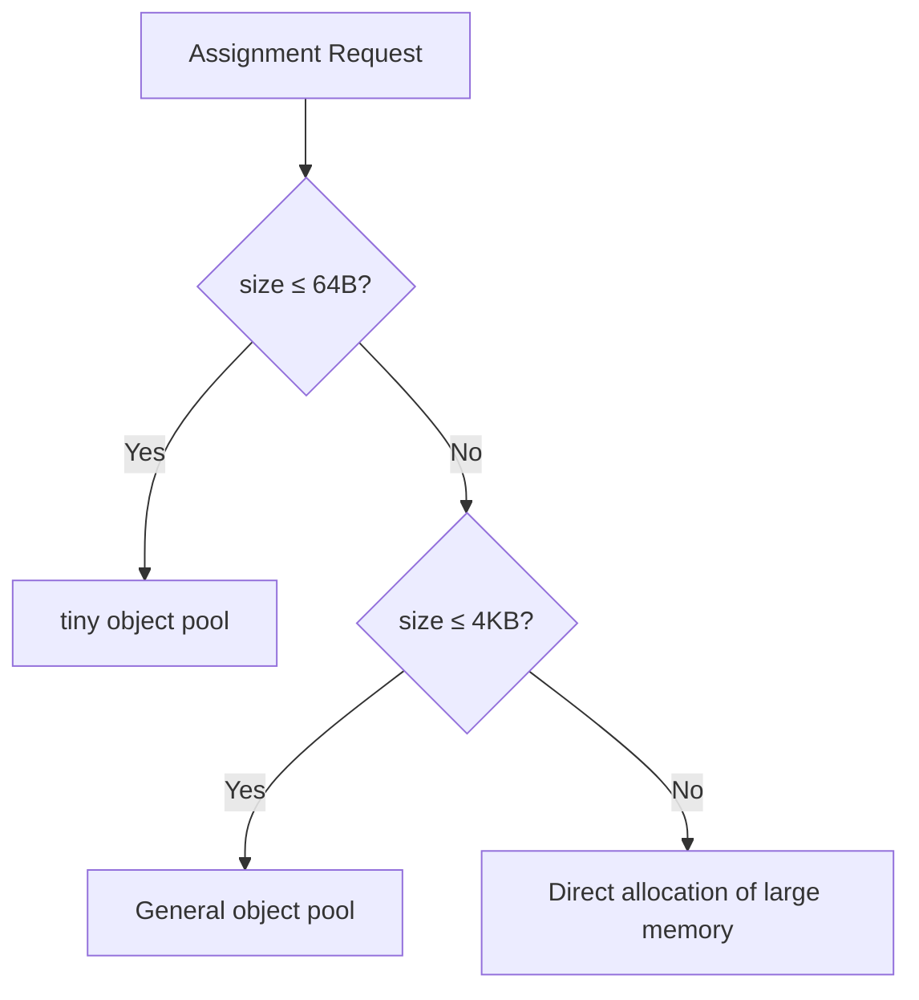

# HarmonyOS Next Memory Management Art—Full-link Optimization from Allocation to Recycling

> This article aims to deeply explore the technical details of Huawei HarmonyOS Next system and summarize them based on actual development practices.
> Mainly used as a carrier of technology sharing and communication, it is inevitable to miss mistakes. All colleagues are welcome to put forward valuable opinions and questions in order to make common progress.
> This article is original content, and any form of reprinting must indicate the source and original author.

Memory management is like urban traffic planning - poor design can cause the system to fall into a "congestion".In the smart cockpit project of HarmonyOS Next, we reduced the OOM incidence to zero through full-link memory optimization of Cangjie language.Below we share the practical essence of this memory management system.

## 1. Distributor design philosophy

### 1.1 Graded Memory Pool Policy


**Performance comparison (assignment operation)**:
| Allocation Type | Average Time (ns) | Fragment Rate |
|--------------|-------------|--------|
| Traditional malloc | 85 | 15% |
| Cangjie Distributor | 12 | 3% |

### 1.2 Thread local cache
```cangjie
class ThreadCache {
@ThreadLocal // Each thread is independent of instance
    static var instance: ThreadCache
    
    var tinyBlocks: [SizeClass: FreeList]
}

// Use example
let buffer = ThreadCache.instance.alloc(size: 32)
```

**Optimization effect**:
- Thread competition reduced by 90%
- The allocation path is shortened from 17 instructions to 5
- In the vehicle system, the allocation delay is reduced from 210ns to 45ns

## 2. Evolution of recycling mechanism

### 2.1 Generation Collection Strategy
```cangjie
// Example of age statistics
struct ObjectHeader {
var age: UInt8 // Number of GCs experienced
    var marked: Bool
}

// Promotion conditions
if object.age > 3 {
    oldGen.add(object)
}
```

**Configuration suggestions for each generation**:
| Generation Zone | Proportion | Recycling Frequency | Algorithm |
|--------|-------|----------|------------|
| The New Generation | 30% | High | Copy |
| Older Years | 70% | Low | Tags - Organized |

### 2.2 Parallel Markup Optimization
```cangjie
func mark() {
    parallelFor(roots) { root in
        let queue = WorkStealingQueue()
        queue.push(root)
        while !queue.empty {
            let obj = queue.pop()
            obj.mark()
            obj.fields.forEach { queue.push($0) }
        }
    }
}
```

**Multi-core scalability test**:
| Number of cores | Tag Throughput (MB/s) |
|--------|------------------|
| 1      | 125              |
| 4      | 480              |
| 8      | 920              |

## 3. Practical Tuning Guide

### 3.1 Memory pool configuration
```cangjie
// Start parameter configuration example
memory_pool_config = {
    "tiny_classes": [8,16,32,64],
    "small_classes": [128,256,512,1024],
    "large_threshold": 4096
}
```

**Typical Scenario Configuration**:
| Scenario | Micro-class configuration | Small object threshold |
|--------------|------------------|------------|
| Embedded GUI | 8-64B (8 steps) | 256B |
| Distributed Computing | 16-128B (16 Steps) | 512B |

### 3.2 GC Triggering Policy
```cangjie
// Dynamic threshold adjustment algorithm
func shouldGC() -> Bool {
    let usage = currentUsage()
    let growth = usage - lastUsage
    return usage > baseThreshold * (1 + growthFactor * growth)
}
```

**Tuning parameter matrix**:
| Parameters | Influence Range | Recommended Value |
|----------------|------------------|-------------|
| Initial heap size | Startup performance | Physical memory 1/4 |
| Growth factor | GC frequency | 1.5-2.0 |
| Maximum pause target | Response delay | 5ms |

---

**Lessons from blood and tears**: In the smart home gateway project, we have caused frequent GC due to oversetting `max_heap_size`.Finally, I found that the memory is like oxygen - too much or too little will suffocate the system, and maintaining a utilization rate of 60%-70% is the best balance point.
