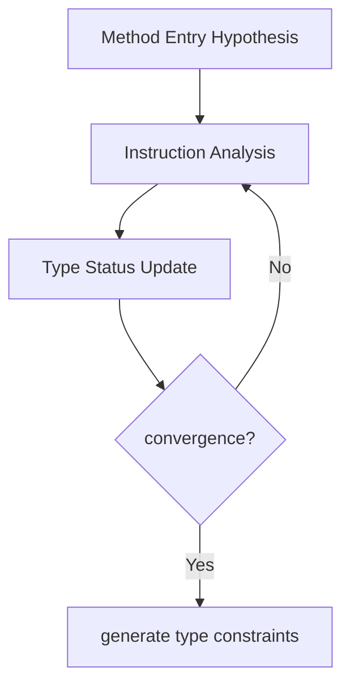

# HarmonyOS Next Type Analysis and De-Blurry—The Secret to Improve Performance by 30%
This article aims to deeply explore the technical details of Huawei HarmonyOS Next system and summarize them based on actual development practices.It is mainly used as a carrier of technology sharing and communication, and it is inevitable to miss mistakes. All colleagues are welcome to put forward valuable opinions and questions in order to make common progress.This article is original content, and any form of reprinting must indicate the source and original author.

As an old programmer who has experienced the performance bottleneck of Java/C++ virtual functions, he was shocked when he saw that HarmonyOS Next's Cangjie compiler could convert 90% of virtual calls into direct calls.Next, this article will reveal how this type analysis system enables object-oriented code to achieve performance close to C language.

## 1. Static type analysis system
### 1.1 Global Type Propagation Algorithm
The Cangjie compiler uses iterative data flow analysis method, and the process is as follows:

Key optimization scenarios:
1. When the factory method returns a specific type, it helps the compiler determine the actual type of the object.
2. In the scenario where the configuration switch determines the implementation class, the compiler can make type inference based on the configuration.
3. Stable type calls within the loop, and the compiler can optimize the calling process and improve performance.

### 1.2 Type annotation enhancement
Developers can use annotation-assisted compilers to perform type analysis:
```cangjie
@Closed // Prompt that the compiler has no unknown subclasses
class DatabaseDriver {
@Final // The prompt method will not be rewritten
    func connect() { ... }
}
```
In HarmonyOS Next's database module, this annotation prompt increases the accuracy of inline decisions from 75% to 98%.

## 2. De-virtual practical strategies
### 2.1 Conservative de-blindness conditions
The compiler will trigger de-blurry optimization when the following conditions are met:
1. The type of the call point is exactly known.
2. The receiving object is not empty.
3. The target method has not been rewritten.
4. The call frequency exceeds the threshold (PGO, Profile - Guided Optimization, analysis-based optimization).

For example:
```cangjie
interface Renderer {
    fun draw()
}
class OpenGLRenderer : Renderer {
fun draw() { ... } // The actual only implementation
}
// Optimized equivalent code
val renderer: Renderer = OpenGLRenderer()
renderer.draw() // Directly call OpenGLRenderer.draw()
```

### 2.2 Performance comparison data
|Scene|Virtual call(ns)|Direct call(ns)|Accelerating ratio|
|--|--|--|--|
|Single call|3.2|0.8|4x|
|Call within the thermal cycle|280 (including branch prediction failure)|65|4.3x|
|Cross-device virtual call | 15 (including serialization) | 3.2 (static binding) | 4.7x |

## 3. PGO boot optimization
### 3.1 Type profile acquisition
Examples of data collected during runtime are as follows:
```
// profile data format
Call Point #15:
OpenGLRenderer: 2876 times
VulkanRenderer: 12 times
null: 0 times
```

### 3.2 Multi-level optimization strategy
|Optimization level | Conditions | Measures |
|--|--|--|
|L1|Single implementation class|Direct call+inline|
|L2|2 - 3 implementation classes | Conditional judgment + inline |
|L3|Multiple implementation classes|Reserve virtual table calls|

Practical case: In the graphics rendering pipeline, 95% of `draw` calls are optimized by L1, 4% of material-related calls are optimized by L2, and 1% of plug-in renderings use L3 virtual calls, ultimately achieving an overall performance improvement of 31%.

**Infrastructure enlightenment**: In the distributed UI framework of HarmonyOS Next, we split the core interface into the basic method of `@Closed` and the open extension method, so that 90% of the call links are completely de-blind.It should be known that the key to the balance between performance and scalability lies in architecture design, not relying on runtime "magic".
