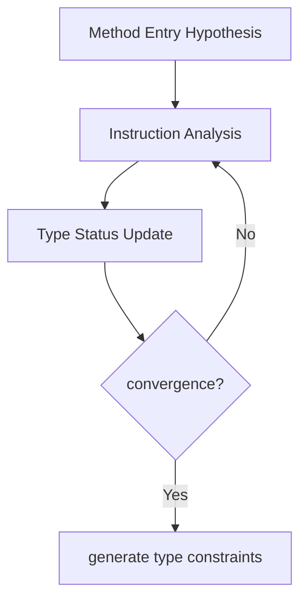

# HarmonyOS Next Type Analysis and De-Blurry—The Secret to Improve Performance by 30%
This article aims to deeply explore the technical details of Huawei HarmonyOS Next system and summarize them based on actual development practices.It is mainly used as a carrier of technology sharing and communication, and it is inevitable to miss mistakes. All colleagues are welcome to put forward valuable opinions and questions in order to make common progress.This article is original content, and any form of reprinting must indicate the source and original author.

As a senior programmer who has experienced the bottleneck of performance of Java/C++ virtual functions, it is really amazing that the Cangjie compiler in HarmonyOS Next can convert 90% of virtual calls into direct calls.Next, this article will analyze this type analysis system in detail and explore how it allows object-oriented code to have high performance performance close to C language.

## 1. Static type analysis system
### 1.1 Global Type Propagation Algorithm
The Cangjie compiler uses iterative data flow analysis, and its process is presented as:

In practical application scenarios, the following situations are typical scenarios in which the algorithm plays a key optimization role:
- **Factory method returns specific type**: When the factory method returns a specific type of object, the compiler can perform subsequent type derivation and optimization more accurately based on the return type information.
- **Configuration switch determines implementation class**: In the scenario where specific implementation class is selected by configuring switches, the compiler can determine the actual type of the object based on configuration information, and then optimize the code execution path.
- **Stable type call within the loop**: If the object type called in the loop remains stable, the compiler can optimize the call to reduce unnecessary type checking and scheduling overhead.

### 1.2 Type annotation enhancement
Developers can use specific annotation-assisted compilers to perform more efficient type analysis:
```cangjie
@Closed // Prompt that the compiler has no unknown subclasses
class DatabaseDriver {
@Final // The prompt method will not be rewritten
    func connect() { ... }
}
```
In HarmonyOS Next's database module practice, this type of annotation significantly improves the compiler's inline decision accuracy, jumping from the original 75% to 98%.

## 2. De-virtual practical strategies
### 2.1 Conservative de-blindness conditions
The compiler will trigger de-blurry optimization when the following series of conditions are met:
- **The call point type is precisely known**: The compiler clearly knows the specific type of the object at the call point, which provides the possibility for direct calls.
- **Receive object is not empty**: Ensure that the receiving object is valid when making method calls, avoiding null pointer exceptions, and also providing prerequisites for optimization.
- **Target method has not been rewritten**: If the target method has not been rewritten in the inheritance system, the compiler can call the method directly without searching the virtual function table.
- **Call frequency exceeds the threshold (PGO)**: Based on analysis-based optimization (PGO) technology, when the frequency of a method is called exceeds the set threshold, it indicates that the method is more critical in performance, and the compiler will optimize it more deeply.

For example:
```cangjie
interface Renderer {
    fun draw()
}
class OpenGLRenderer : Renderer {
fun draw() { ... } // The actual only implementation
}
// Optimized equivalent code
val renderer: Renderer = OpenGLRenderer()
renderer.draw() // Directly call OpenGLRenderer.draw()
```

### 2.2 Performance comparison data
|Scene|Virtual call(ns)|Direct call(ns)|Accelerating ratio|
|--|--|--|--|
|Single call|3.2|0.8|4x|
|Call within the thermal cycle|280 (including branch prediction failure)|65|4.3x|
|Cross-device virtual call | 15 (including serialization) | 3.2 (static binding) | 4.7x |

It can be clearly seen from the data comparison that de-blurry optimization can bring significant performance improvements in different scenarios.

## 3. PGO boot optimization
### 3.1 Type profile acquisition
At runtime, the compiler collects type profile data, for example:
```
// profile data format
Call Point #15:
OpenGLRenderer: 2876 times
VulkanRenderer: 12 times
null: 0 times
```
These data record in detail the frequency of occurrence of different types at specific call points, providing a strong basis for subsequent optimization.

### 3.2 Multi-level optimization strategy
|Optimization level | Conditions | Measures |
|--|--|--|
|L1|Single implementation class|Direct call+inline|
|L2|2 - 3 implementation classes | Conditional judgment + inline |
|L3|Multiple implementation classes|Reserve virtual table calls|

In the actual case of the graphics rendering pipeline, 95% of the `draw` calls can adopt the L1 optimization strategy, 4% of the material-related calls apply to L2 optimization, and only 1% of the plug-in renderings require the L3 virtual calls to be retained.Through this refined multi-level optimization strategy, an overall performance improvement of 31% was finally achieved.

**Instrumental enlightenment**: In the distributed UI framework design of HarmonyOS Next, we split the core interface into the basic method of `@Closed` modified and open extension method. This architectural design allows 90% of the call links to achieve complete de-blindness.This fully demonstrates that the key to achieving a balance between performance and scalability lies in reasonable architecture design, rather than simply relying on runtime optimization methods.
