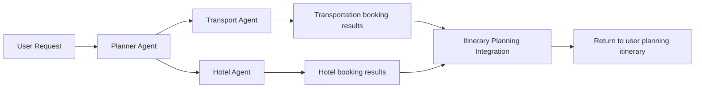

# HarmonyOS Next Practical Practice: Intelligent Travel Planning System Based on Agent DSL
In the development practice of HarmonyOS Next, using Agent DSL to build intelligent applications is an effective way to fully utilize its native AI capabilities.Below, I will combine my experience in developing an intelligent travel planning system to introduce in detail how to conduct requirements analysis, architecture design, core code implementation, and performance tuning and deployment based on Agent DSL.

## 1. Requirements Analysis and Architecture Design
### (I) Multiple Agent collaborative architecture diagram (Planner/Transport/Hotel Agent role division)
The intelligent travel planning system is designed to provide users with personalized and one-stop travel planning services.After demand analysis, the system mainly involves core functions such as itinerary planning, transportation reservation and hotel reservation.To achieve these functions, we adopt a multi-agent collaborative architecture, mainly including Planner Agent, Transport Agent and Hotel Agent.The architecture diagram is as follows:

Planner Agent is responsible for receiving information about users' travel needs, such as travel destination, time, budget, etc., and developing a preliminary travel planning framework based on these needs.It is like the "chief designer" of travel planning, coordinating the overall situation.For example, if the user proposes "I want to travel to Chengdu within 7 days, with a budget of 5,000 yuan", Planner Agent will initially plan the daily itinerary and determine the general order of visiting attractions.

Transport Agent is responsible for inquiring and booking suitable means of transportation, such as airplanes, trains, city transportation, etc., according to the itinerary framework formulated by Planner Agent.It interacts with major transportation booking platforms to obtain real-time ticketing information and prices, and chooses the most cost-effective transportation solution for users.

Hotel Agent searches and books suitable hotels on the corresponding hotel reservation platform based on the itinerary and the user's accommodation preferences.It will take into account the hotel's location, price, evaluation and other factors to ensure that users can provide satisfactory accommodation options.

These three agents work together to complete travel planning tasks and provide users with a complete travel plan.

## 2. Core code implementation
### (I) `@prompt` parameter dynamic optimization and streaming collaborative code
In the core code implementation, dynamic optimization of the `@prompt` parameter and streaming collaboration of multiple agents are key.Take Planner Agent as an example:
```cj
@agent class Planner {
    @prompt[pattern=PlanTrip] (
action: "Develop a travel plan according to user needs",
purpose: "Meet users' travel expectations and provide reasonable itinerary",
expectation: "Generate a travel plan that includes attractions, time, and budget allocations"
    )
    func planTrip(userRequest: String): String {
// Analyze user requests to obtain key information
        let requestInfo = parseRequest(userRequest);
// Dynamically optimize the itinerary based on real-time travel data and user preferences
        let optimizedPlan = optimizePlan(requestInfo);
        return optimizedPlan;
    }
}
```
In the above code, `@prompt` describes the behavior patterns and expected results of the Agent in detail.The user request is parse through the `parseRequest` function, and the `optimizePlan` function combines real-time data (such as the opening hours of scenic spots, traffic, etc.) and user preferences (such as if you like natural scenery or historical and cultural attractions).

The streaming collaborative code between multiple agents is as follows:
```cj
func main() {
let userRequest = "I want to travel to Chengdu within 7 days, with a budget of 5,000 yuan, and I like historical and cultural attractions";
    let planner = Planner();
    let transport = Transport();
    let hotel = Hotel();

// Planner formulates the itinerary
    let plan = planner.planTrip(userRequest);

// Book transportation according to the itinerary
    let transportResult = transport.bookTransport(plan);

// Book a hotel according to the itinerary
    let hotelResult = hotel.bookHotel(plan);

// Integration results
    let finalPlan = integrateResults(plan, transportResult, hotelResult);
    print(finalPlan);
}
```
This code shows how three agents work together in sequence.After Planner formulates the itinerary, Transport and Hotel make transportation and hotel reservations according to the itinerary, and finally consolidate the results and return them to the user.

## 3. Performance Tuning and Deployment
### (I) Visual tool analyzes Agent communication bottlenecks
In terms of performance tuning, the visual parallel concurrent tuning tool provided by HarmonyOS Next is used to analyze the communication bottlenecks between agents.In the tool's Tasks lanes and Measure lanes, you can view the time consumption and frequency of messaging between different agents.For example, if you find that the message delivery delay is high between the Transport Agent and the Planner Agent, it may be because the traffic reservation interface is slow to respond or the data transmission is too large.

Through analysis, we can take corresponding optimization measures.For example, cache optimization of traffic reservation interfaces can reduce duplicate queries; or optimize data structures can reduce the amount of data passed between agents.After optimization, visual tools are used again for monitoring to ensure that communication efficiency is improved, the entire travel planning system responds faster, and provides users with a smoother user experience.

During the deployment stage, the deployment method is reasonably selected based on the system's usage scenario and user scale.If it is an internal trial version for a small number of users, it can be deployed locally; if it is an official version for a large number of users, it is necessary to consider cloud deployment, and use the elastic expansion capabilities of cloud services to meet the needs of different users and ensure the stability and reliability of the system.

The intelligent travel planning system built on Agent DSL fully demonstrates the advantages of HarmonyOS Next native AI development.Through multi-agent collaboration, `@prompt` parameter optimization and performance tuning, efficient and intelligent travel planning services can be created.I hope my experience sharing can provide you with useful reference in application development based on HarmonyOS Next, and jointly explore more innovative applications.
